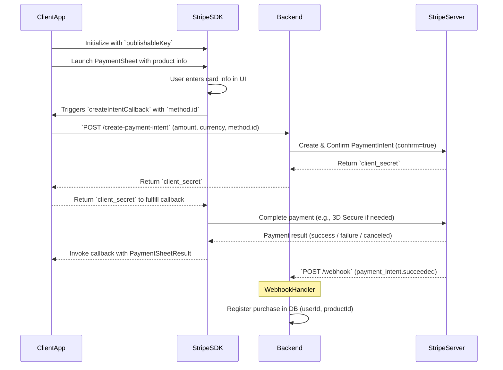

# Simple OneClick Checkout Stripe Backend
Collect card info on UI → Stripe requests paymentIntent (clientSecret) creation by passing a `method.id` of the collected data



## Create Stripe Account
1. Create account: https://dashboard.stripe.com/login.
2. Developer keys: https://dashboard.stripe.com/test/apikeys.
3. Create client_secret with backend or https://docs.stripe.com/stripe-cli.
```bash
stripe login
stripe payment_intents create --amount 1099 --currency usd
```

## Run simple Stripe Go backend
1. Initialize, create `go.mod`.
```bash
go mod init stripe_backend
```

2. Install Stripe
```bash
go get github.com/stripe/stripe-go/v78
```
```bash
go get github.com/stripe/stripe-go/webhook
```

3. Export Stripe secret key (from https://dashboard.stripe.com/test/apikeys).
```bash
export STRIPE_SECRET_KEY=sk_test_abc....
```

4. Run
```bash
go run main.go
```
Links
* Method type: https://dashboard.stripe.com/test/settings/payment_methods


## Test

1. Curl
```bash
curl -X POST http://localhost:8080/create-payment-intent \
  -H "Content-Type: application/json" \
  -d '{
    "amount": 1500,
    "currency": "usd",
    "userId": "42",
    "productId": "product_666"
  }'
```
> Will fail because of missing method.id, comment `region confirm` on `main.go`.

2. Android
```kotlin
// Activity.onCreate
PaymentConfiguration.init(
    context = this,
    // https://dashboard.stripe.com/test/apikeys
    publishableKey = "pk_test_...",
)

// Example: Calling with Ktor
// Use 10.0.2.2 instead of localhost to test on Android Emulator.
val response = client.post("http://10.0.2.2:8080/create-payment-intent") {
  contentType(ContentType.Application.Json)
  setBody("""{
      "methodId": "$methodId",
      "amount": 1000,
      "currency": "usd",
      "userId": "user_123",
      "productId": "product_abc"
    }
    """.trimIndent()
    )
}
```

```kts
// build.gradle.kts
dependencies {
    implementation(libs.stripe.payments.core)
    implementation(libs.stripe.payments.sheet)
}
```

```toml
// libs.versions.toml
[versions]
stripeAndroid = "21.12.0"
[libraries]
stripe-payments-core = { module = "com.stripe:payments-core", version.ref = "stripeAndroid" }
stripe-payments-sheet = { module = "com.stripe:paymentsheet", version.ref = "stripeAndroid" }
```
